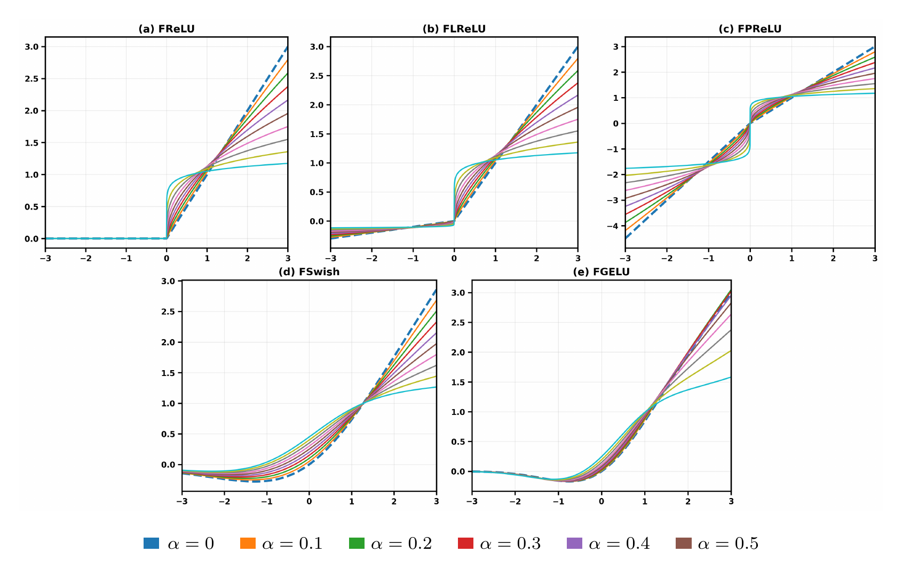

# Fractional Activation Functions for Off-Policy Reinforcement Learning

[](https://www.python.org/)
[](https://pytorch.org/)
[](LICENSE)
[](#experiments)

<p align="center">
  
</p>

<p align="center">
  <em>Fractional activation families across different fractional orders.</em>
</p>

A standalone research implementation for studying **fractional-order activation functions in off-policy deep reinforcement learning**.

The repository evaluates fractional activations as lightweight architectural modifications to actor and critic neural networks while keeping the underlying reinforcement-learning algorithms unchanged.

The experiments use **Twin Delayed Deep Deterministic Policy Gradient (TD3)** and **Soft Actor-Critic (SAC)** across continuous-control tasks from MuJoCo and the DeepMind Control Suite.

---

## Overview 

Activation functions define the nonlinear transformations used inside actor and critic networks.

Standard activations such as ReLU, Leaky ReLU, PReLU, GELU, and Swish are effective in deep learning, but their fixed functional forms may restrict how neural representations adapt to different reinforcement-learning problems.

Fractional-order activation functions introduce an additional parameter, the **fractional order**

\[
\alpha,
\]

which changes the shape and curvature of the nonlinear transformation.

This repository evaluates five conventional activation families together with their fractional counterparts:

| Family | Conventional | Fractional | Description |
|---|---|---|---|
| Rectifier | ReLU | FReLU | Fractional transformation of the positive ReLU branch |
| Rectifier | Leaky ReLU | FLReLU | Fractional positive and negative branches |
| Rectifier | PReLU | FPReLU | Fractional PReLU-style transformation |
| Smooth | GELU | FGELU | Fractional extension of GELU |
| Smooth | Swish | FSwish | Fractional extension of Swish |

The evaluated fractional orders are

\[
\alpha \in \{0.1, 0.2, 0.3, 0.4, 0.5\}.
\]

The fractional order is fixed within each experiment and treated as an **activation-specific hyperparameter**.

It is not intended to represent a quantity that should always be increased: different tasks, algorithms, activations, and network placements can prefer different values of \(\alpha\).

---

## Fractional Activations

### FReLU

The rectifier-based fractional formulation uses a Gamma-normalized fractional power:

```text
FReLU_alpha(x) = x^(1-alpha) / Gamma(2-alpha),   if x > 0
                 0,                              otherwise
```

### FLReLU

FLReLU extends the same fractional transformation to the negative branch:

```text
FLReLU_alpha(x) =  x^(1-alpha) / Gamma(2-alpha),        if x > 0
                  -k*(-x)^(1-alpha) / Gamma(2-alpha),   if x < 0
                   0,                                    if x = 0
```

where `k` controls the negative-branch slope.

### FPReLU

FPReLU introduces a learnable negative-branch coefficient while retaining the fractional power transformation. This allows the negative response to adapt during training while the fractional order `alpha` controls the nonlinear curvature.

### FGELU

FGELU extends the smooth GELU activation through a finite fractional transformation. The fractional order `alpha` controls the degree of fractional modulation applied to the GELU response.

### FSwish

FSwish extends the smooth Swish/SiLU family with a fractional correction controlled by the fractional order `alpha`.

The implementations used in the experiments are located in:

```text
src/frorl/models/activations.py
```

Earlier experimental activation variants retained from the original research code are isolated in:

```text
src/frorl/models/legacy_activations.py
```

They are preserved for provenance and compatibility but are **not part of the main experimental activation set**.

## Research Findings

The experiments show that fractional activation design can improve off-policy actor-critic learning without modifying the underlying reinforcement-learning algorithm.

Key observations include:

- Fractional activations frequently outperform ReLU and their corresponding conventional activation families.
- Fractional variants of smooth activations such as GELU and Swish can improve upon already strong smooth baselines.
- The preferred fractional order depends on the activation family, environment, algorithm, network depth, and activation placement.
- Actor-side and early-layer placements are frequently competitive in two-hidden-layer networks.
- SAC generally shows more consistent seed-level behaviour, while TD3 can exhibit larger task-dependent gains and greater variability.
- Improvements are achieved by modifying only the hidden-layer activation functions while leaving replay, target updates, policy updates, optimizers, and training budgets unchanged.

These results support fractional activations as a lightweight architectural mechanism for modifying nonlinear representation in continuous-control reinforcement learning.

---

# Experiments

## Algorithms

The repository contains standalone implementations of:

- **Twin Delayed Deep Deterministic Policy Gradient (TD3)**
- **Soft Actor-Critic (SAC)**

The learning rules of these algorithms are not changed by the fractional-activation experiments.

---

## Benchmarks

| Benchmark suite | Tasks |
|---|---|
| MuJoCo | Ant-v4 |
|  | HalfCheetah-v4 |
|  | Hopper-v4 |
|  | Humanoid-v4 |
| DeepMind Control Suite | Walker-Walk |
|  | Cheetah-Run |
|  | Finger-Spin |
|  | Cartpole-Swingup |

---

## Activation Set

### Conventional activations

```text
ReLU
LReLU
PReLU
GELU
Swish
```

### Fractional activations

```text
FReLU
FLReLU
FPReLU
FGELU
FSwish
```

---

## Network Architectures

Experiments use hidden-layer width

```text
256
```

and evaluate both:

```text
1 hidden layer
2 hidden layers
```

For a single-hidden-layer network:

```text
Input
  |
Linear(256)
  |
Activation
  |
Output
```

For a two-hidden-layer network:

```text
Input
  |
Linear(256)
  |
Activation 1
  |
Linear(256)
  |
Activation 2
  |
Output
```

Only hidden-layer activation functions are changed between experimental conditions.

---

## Activation Placement

For the two-hidden-layer architecture, five placement strategies are evaluated:

| Placement | Description |
|---|---|
| `all-actor` | selected activation in all actor hidden layers |
| `all-critic` | selected activation in all critic hidden layers |
| `all-both` | selected activation in all actor and critic hidden layers |
| `first-actor` | selected activation only in the first actor hidden layer |
| `first-both` | selected activation only in the first hidden layer of actor and critic |

Layers not assigned the selected activation use ReLU.

For the single-hidden-layer experiments, the selected activation is applied to both actor and critic hidden layers.

---

## Evaluation Protocol

The experimental design uses:

- one-hidden-layer and two-hidden-layer actor-critic networks;
- hidden width of 256;
- five random seeds per configuration;
- fractional orders

```text
0.1
0.2
0.3
0.4
0.5
```

- matched reinforcement-learning hyperparameters;
- matched network architectures;
- matched optimization settings;
- matched training budgets;
- matched evaluation intervals;
- identical random seeds for paired comparisons.

Performance is evaluated using complete learning trajectories rather than final return alone.

---

## Evaluation Metrics

The analysis includes:

- normalized area under the learning curve;
- mean performance across seeds;
- standard deviation across seeds;
- bootstrap confidence intervals;
- paired Wilcoxon signed-rank tests;
- Cliff's delta effect sizes;
- sign-test summaries;
- task-level activation comparisons;
- fractional-order sensitivity analysis;
- activation-placement analysis.

---

# Installation

Clone the repository:

```bash
git clone https://github.com/UoA-CARES/fractional-activation-functions-rl.git
cd fractional-activation-functions-rl
```

Create a virtual environment:

```bash
python -m venv .venv
```

Activate it.

### Linux / macOS

```bash
source .venv/bin/activate
```

### Windows Command Prompt

```bat
.venv\Scripts\activate
```

### Windows PowerShell

```powershell
.venv\Scripts\Activate.ps1
```

Upgrade pip:

```bash
python -m pip install --upgrade pip
```

Install the package:

```bash
pip install -e .
```

For experiment dependencies:

```bash
pip install -e ".[gym]"
```

For development and testing:

```bash
pip install -e ".[test]"
```

---

# Verify the Installation

Run the test suite:

```bash
pytest
```

You can also directly verify the activation implementations:

```bash
python scripts/check_activations.py
```

This checks the conventional and fractional activation functions on sample inputs.

---

# Running Experiments

The main training entry point is:

```text
scripts/train.py
```

Experiments can be configured directly from the command line.

---

## Example: ReLU Baseline

TD3 with ReLU:

```bash
python scripts/train.py \
  --algo TD3 \
  --env HalfCheetah-v4 \
  --activation relu \
  --layers 1 \
  --placement both \
  --seed 0
```

SAC with ReLU:

```bash
python scripts/train.py \
  --algo SAC \
  --env HalfCheetah-v4 \
  --activation relu \
  --layers 1 \
  --placement both \
  --seed 0
```

---

## Example: FReLU

```bash
python scripts/train.py \
  --algo TD3 \
  --env HalfCheetah-v4 \
  --activation frelu \
  --alpha 0.3 \
  --layers 1 \
  --placement both \
  --seed 0
```

---

## Example: FGELU

```bash
python scripts/train.py \
  --algo SAC \
  --env Hopper-v4 \
  --activation fgelu \
  --alpha 0.1 \
  --layers 1 \
  --placement both \
  --seed 0
```

---

## Example: Two-Layer Placement Experiment

```bash
python scripts/train.py \
  --algo TD3 \
  --env HalfCheetah-v4 \
  --activation flrelu \
  --alpha 0.1 \
  --layers 2 \
  --placement first-actor \
  --seed 0
```

---

# Running an Alpha Sweep

To evaluate multiple fractional orders:

```bash
python scripts/run_alpha_sweep.py \
  --algo TD3 \
  --env HalfCheetah-v4 \
  --activation frelu \
  --layers 1
```

The standard fractional-order search space is:

```text
0.1, 0.2, 0.3, 0.4, 0.5
```

---

# Running the Experiment Matrix

A larger experiment matrix can be launched with:

```bash
python scripts/run_matrix.py \
  --algo TD3 \
  --env HalfCheetah-v4 \
  --layers 2
```

The matrix runner can iterate over combinations of:

- activation family;
- fractional order;
- placement strategy;
- random seed;
- algorithm;
- environment.

This keeps the underlying TD3/SAC configuration fixed while changing the experimental activation variables.

---

# Results and Analysis

Training outputs are stored under:

```text
results/
```

Each experiment records information including:

- algorithm;
- environment;
- activation;
- fractional order;
- network depth;
- activation placement;
- random seed;
- training step;
- evaluation return.

---

## Normalized Area Under the Learning Curve

Normalized AUC can be computed using:

```bash
python scripts/analyze_auc.py \
  --results results/
```

For a learning curve \(R(t)\) evaluated over training budget \(T\),

\[
\operatorname{AUC}_{\mathrm{norm}}
=
\frac{1}{T}
\int_0^T R(t)\,dt.
\]

This captures learning performance across the complete training trajectory rather than relying only on the final evaluation point.

---

# Reproducibility

To make activation comparisons meaningful, fractional and non-fractional experiments should use identical:

- environments;
- task definitions;
- TD3/SAC hyperparameters;
- actor and critic widths;
- network depth;
- replay-buffer settings;
- learning rates;
- optimizers;
- training budgets;
- evaluation frequencies; and
- random seeds.

The activation function, fractional order, and placement strategy are the primary experimental variables.

---

# Repository Structure

```text
fractional-activation-functions-rl/
|
|-- src/
|   `-- frorl/
|       |
|       |-- algorithms/
|       |   |-- td3.py
|       |   `-- sac.py
|       |
|       |-- models/
|       |   |-- activations.py
|       |   |-- legacy_activations.py
|       |   `-- networks.py
|       |
|       |-- memory/
|       |   `-- replay_buffer.py
|       |
|       |-- training/
|       |   `-- train_loops.py
|       |
|       |-- environments/
|       |
|       |-- experiments/
|       |
|       |-- analysis/
|       |
|       `-- utils/
|
|-- scripts/
|   |-- train.py
|   |-- run_alpha_sweep.py
|   |-- run_matrix.py
|   |-- analyze_auc.py
|   `-- check_activations.py
|
|-- configs/
|   |-- td3/
|   |-- sac/
|   `-- experiments/
|
|-- tests/
|
|-- assets/
|   `-- fractional_activation_overview.png
|
|-- results/
|
|-- README.md
|-- LICENSE
|-- CITATION.cff
|-- pyproject.toml
`-- .gitignore
```

---

# Design Principle

The central experimental principle of this repository is deliberately simple:

> **Change the activation function, not the reinforcement-learning algorithm.**

TD3 and SAC retain their standard:

- replay mechanisms;
- Bellman targets;
- policy updates;
- entropy optimization;
- delayed updates;
- target networks; and
- optimization procedures.

This allows the effect of activation-function design to be studied independently from changes to the reinforcement-learning algorithm itself.

---


For publication and reproducibility, the code relevant to the fractional-activation study has been extracted into this smaller standalone repository.

The standalone version focuses specifically on:

- TD3;
- SAC;
- fractional activation functions;
- activation placement;
- continuous-control environments; and
- experiment reproduction.

This avoids requiring the full CARES RL codebase to reproduce the activation study.


# Acknowledgements

This work was developed within the **Centre for Automation and Robotic Engineering Science (CARES)** at **The University of Auckland**.


---

# License

This repository is released under the **MIT License**.

See [LICENSE](LICENSE) for details.

Third-party software components remain subject to their respective licenses and attribution requirements.
